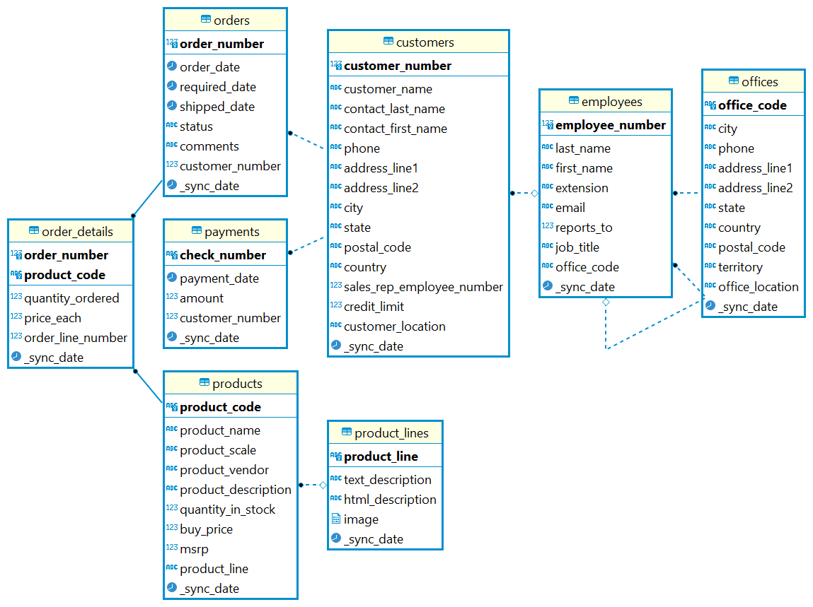
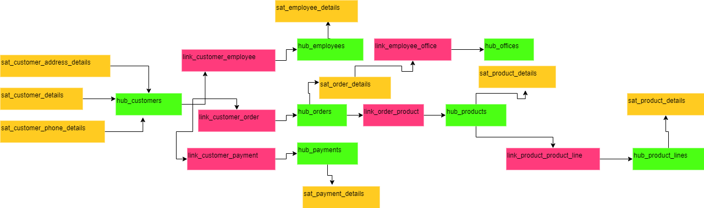
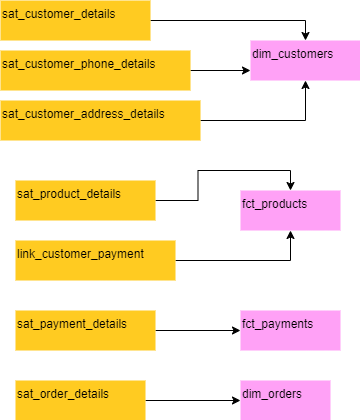

## Overview
This dbt project reads data from the landing zone, which is loaded by a SQL script. It utilizes the automate_dv dbt package to create a raw data vault. The models in the raw data vault are used in the marts layer to create dimension and fact models. These dimensions and facts are then used by reporting tools.

## Setup Database and tables
1. Install the PostgreSQL database from the web for this dbt project.
2. Ensure that the database runs on port 5432 and create a user 'postgres' and database 'analytics' because we have hardcoded these details in the dbt_project.yml file.
3. Download and install the DBeaver tool and connect to analytics database. Afterward, execute the script located at data_vault\setup_script\create_tables_load_data.sql. This script will create the necessary landing tables.
## Setup dbt
1. Make sure you have Python version 3.9 or higher installed on your computer.
2. Create a Python virtual environment named 'datavault' using the command 'virtualenv datavault'.
3. Activate the virtual environment in your Terminal.
Install dbt for PostgreSQL by running 'pip install dbt-postgres'.
4. Download the dbt project from the repository you're using.
Navigate to the project repository in your Terminal and run the following commands:

    a. Open dbt_profiles.yml to update target database configuration like database, schema, passwords etc
    
    b. Run 'dbt deps' to install the project's dependencies.

    c. Execute 'dbt run' to run the dbt models, which will materialize them as tables or views.
    
    d. Generate required artifacts for the dbt project documentation with 'dbt docs generate'.

    e. Launch the dbt docs website by running 'dbt docs serve'.

## Source tables ERD

## RAW Vault

## Data Mart

